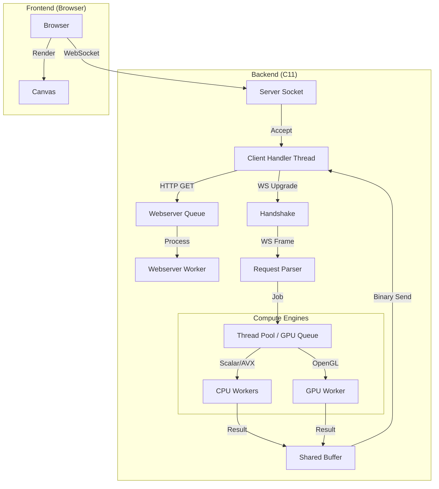

# Project Documentation

## 1. Architecture Overview

The system follows a client-server architecture where the heavy lifting (calculating Mandelbrot set escape times) is performed by a highly optimized C backend, and the visualization is handled by a lightweight JavaScript frontend.

### Component Diagram



## 2. Directory Structure

- `backend/src/`: Core C source code.
  - `server.c`: Main entry point, socket handling, and client connection loop.
  - `webserver.c`: HTTP server implementation, serving static files safely.
  - `websocket.c`: WebSocket protocol implementation (handshake, framing).
  - `mandelbrot.c`: The mathematical core. Contains Scalar, AVX, and OpenGL implementations.
  - `tpool.c`: A generic thread pool for distributing CPU rendering tasks.
  - `include/`: Header files defining interfaces and data structures.
- `backend/frontend/`: Static web assets (`index.html`, `script.js`, `style.css`).

## 3. Rendering Modes

### 3.1 Scalar (CPU)

The baseline implementation using standard `double` precision math. It iterates over the image pixels in a nested loop.

- **Optimization:** Checks for periodicity (Points inside the main cardioid/bulb) to exit early.

### 3.2 SIMD (CPU - AVX/AVX2/AVX-512)

Exploits Data-Level Parallelism to process multiple pixels simultaneously.

- **AVX-512:** Processes 8 `double` precision pixels per instruction. Uses 512-bit ZMM registers and mask registers for conditional logic (divergence checking).
- **AVX2:** Processes 4 `double` precision pixels per instruction. Since AVX2 lacks 512-bit registers, it uses YMM registers.
- **Implementation Note:** Uses "vertical" SIMD processing (calculating 4/8 neighboring pixels in X direction together).

### 3.3 GPU (OpenGL Compute Shaders)

Leverages the massive parallelism of GPUs.

- **Headless Context:** Uses EGL to create an OpenGL context without a windowing system (X11/Wayland), enabling the server to run in Docker or on headless servers.
- **Compute Shader:** The rendering logic is written in GLSL (`#version 430`).
- **Precision Optimization:** The shader automatically switches between `float` (FP32) and `double` (FP64). If the zoom level is shallow (`x_scale > 1e-7`), it uses `float` for significantly faster performance (2x-64x depending on hardware).
- **Persistent Mapping:** Uses `glMapBufferRange` with `GL_MAP_PERSISTENT_BIT` to map GPU memory directly to the CPU's address space, minimizing data transfer overhead.

## 4. Web Server & Concurrency

### HTTP Handling

The web server runs in a dedicated thread with its own request queue (`webserver_t`).

1. **Ingest:** When the main server loop detects a `GET` request, it enqueues the request descriptor.
2. **Process:** The worker thread dequeues requests, resolves the path relative to the root (`/var/www`), checks for security violations (e.g., `..`), and streams the file content.
3. **MIME Types:** Automatically detects content types for `.html`, `.css`, `.js`, `.png`.

### WebSocket Handling

- **Handshake:** Validates the `Sec-WebSocket-Key`, computes the SHA1 hash, base64 encodes it, and returns the `101 Switching Protocols` response.
- **Framing:**
  - **Receiving:** Supports unmasked and masked text frames.
  - **Sending:** Constructs binary frames (Opcode 0x2) with appropriate 7-bit, 16-bit, or 64-bit payload length headers.

### Threading Model

- **Main Thread:** Accepts TCP connections. Spawns a dedicated thread for each connected client.
- **Client Threads:** Handle the WebSocket lifecycle for a single user. They parse requests and submit rendering jobs.
- **Worker Threads (CPU):** A pool of threads (default: CPU core count) executing `render_slice_wrapper`.
- **GPU Thread:** A single dedicated thread that owns the OpenGL context and processes the GPU queue sequentially.

## 5. Build & Usage

### Prerequisites

- Docker and Docker Compose
- (Optional) NVIDIA Container Toolkit for NVIDIA GPU support.

### Building and Running

The project includes specific Docker configurations for different hardware backends.

**1. Scalar/CPU Mode (Universal):**

```bash
docker-compose -f docker-compose.scalar.yml up --build
```

**2. AVX-512/SIMD Mode (Requires Intel CPU with AVX):**

```bash
docker-compose -f docker-compose.intel.yml up --build
```

**3. NVIDIA GPU Mode:**

```bash
docker-compose -f docker-compose.nvidia.yml up --build
```

### Accessing the Application

Once running, open a web browser and navigate to:
`http://localhost:8080`

### Controls

- **Pan:** Click and drag.
- **Zoom:** Scroll wheel.
- **Reset:** Double click.
- **Theme:** Select from the dropdown (Ocean, Fire, Matrix, etc.).
- **Resolution:** Lower the divider (e.g., 1/2, 1/4) for faster framerates on slow networks.
- **Animation:** Use the "Add Keyframe" and "Play" buttons to create and view smooth flight paths.
